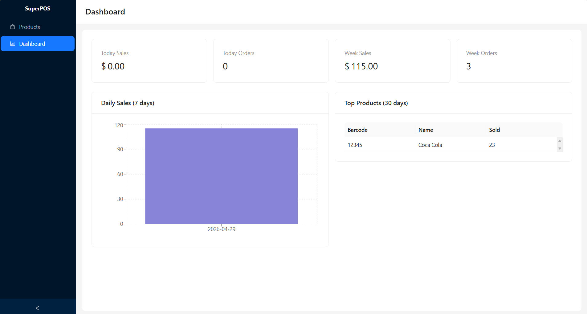
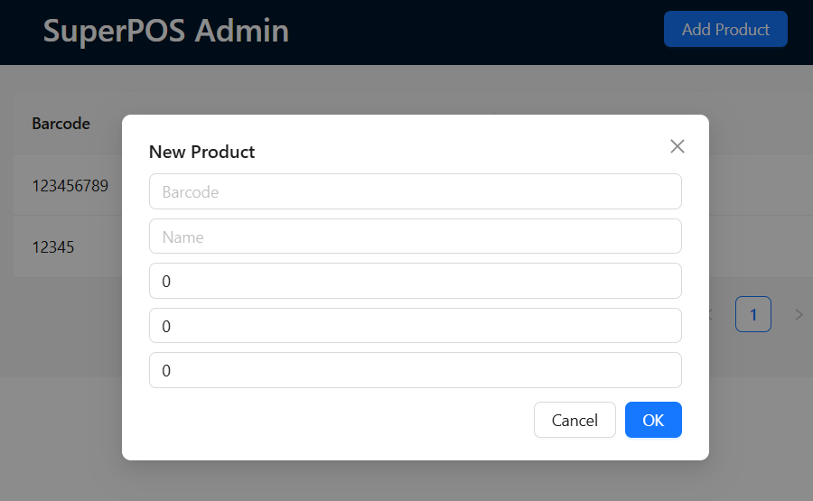
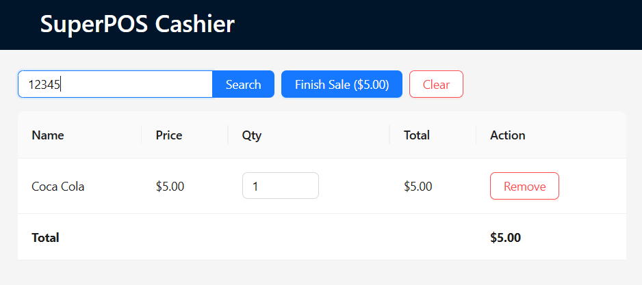

# 🛒 SuperPOS — Next-Gen Supermarket System

[](https://github.com/Nersisiian/SuperPOS/actions)
[](https://github.com/Nersisiian/SuperPOS/actions)
[](https://opensource.org/licenses/MIT)
[](https://www.docker.com/)

**Production-ready point-of-sale system with offline mode, barcode/QR scanning, analytics dashboard, and Docker support.**

## 📸 Screenshots

| Dashboard | Admin Panel | Cashier |
|-----------|-------------|---------|
|  |  |  |

## 🚀 Features

- 🧾 **Cashier terminal** (React + Vite) — keyboard-emulated barcode/QR scanner
- 📊 **Admin panel** — product management and sales dashboard
- 📈 **Analytics** — daily revenue chart, top products, summary stats
- 📡 **Offline mode** — IndexedDB cache, auto-sync pending receipts
- 🎯 **Promo engine** — buy X get Y, percent discounts
- 🐳 **Docker Compose** — one-command start
- ⚙️ **CI/CD** — GitHub Actions + CodeQL security analysis
- 🗃️ **SQLite** (sql.js) — zero configuration, works in any environment

## 🏁 Quick Start

### With Docker (recommended)
```bash
docker-compose up -d
API: http://localhost:3000

Cashier: http://localhost:5173

Admin: http://localhost:3001

# Terminal 1 – backend
cd backend && npm install && npm run start:dev

# Terminal 2 – pos client
cd pos-client && npm install && npm run dev

# Terminal 3 – admin panel
cd admin-panel && npm install && npm run dev
```
## 📚 Documentation

- Architecture
- API Reference
- Hardware setup

## 🤝 Contributing

Pull requests are welcome! Please read [CONTRIBUTING.md](CONTRIBUTING.md) for guidelines.

## 📄 License

This project is licensed under the MIT License — see the [LICENSE](LICENSE) file for details.
